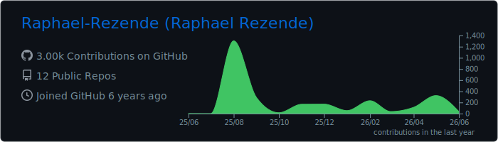
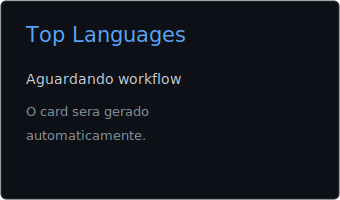
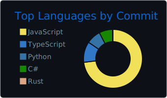

# Raphael Emanuel Rezende

**Desenvolvedor Full Stack | React, Node.js, Electron & PostgreSQL | Automação e sistemas desktop**

  
  
  
  
  
  

  
  
  

---

## Sobre mim

Sou desenvolvedor Full Stack formado em Análise e Desenvolvimento de Sistemas, com experiência em aplicações web, automação de processos e construção de sistemas completos. Trabalho principalmente com **React, Node.js, Electron, PostgreSQL, MongoDB, Python, JavaScript, Selenium e Vitest**.

Tenho vivência em rotinas administrativas, estoque e almoxarifado, o que ajuda a transformar problemas operacionais em software prático: ERPs, automações, importação de dados, cadastros, relatórios e interfaces que reduzem trabalho manual.

- Base forte em **web, desktop, banco de dados e automações**.
- Experiência com **ERP desktop usando Electron + React + Node.js + PostgreSQL**.
- Projetos com **cardápio digital, pedidos via WhatsApp, coleta de dados e dashboards**.
- Interesse em **produtos SaaS, integrações, análise de dados, React Native e Unity/C#**.
- Inglês intermediário e foco em evoluir produtos reais com boa organização técnica.

---

## Stack principal

### Linguagens e runtime

### Frontend e desktop

### Backend, dados e automação

### Ferramentas

---

## Projetos em destaque

| Projeto | O que entrega | Stack |
| --- | --- | --- |
| [**ERP Xerife**](https://sistemaxerife.com.br/) | ERP desktop proprietário para gestão de almoxarifado, estoque, compras, ordens de serviço e financeiro, com suporte online/offline. | Electron, React, Node.js, PostgreSQL, Vitest |
| [Sistema Web para Pizzaria](https://sitepizzariasanbashisystems.netlify.app/) / [repo](https://github.com/Raphael-Rezende/react-restaurant) | Cardápio digital responsivo com carrinho, cálculo automático de pedido e envio direto pelo WhatsApp. | React, Bootstrap, Netlify |
| [SearchMaps](https://github.com/Raphael-Rezende/SearchMaps) | Minerador de dados do Google Maps com modo terminal, exportação de dados e demo web para buscas rápidas. | Python, Selenium, SQLite, FastAPI, Next.js, Docker |
| [Favosia](https://github.com/Raphael-Rezende/favosia) | App web com mapa persistente, painel lateral, cadastro, geocoding por endereço e filtro por raio. | React/Next.js, mapas, localStorage, Nominatim |
| [Xerife Analytics](https://github.com/Raphael-Rezende/xerife-analytcs) | Base pública para evoluir análises e visualizações ligadas ao ecossistema Xerife. | Dados, dashboards, produto |

### Painel rápido

| Área | Foco atual | Por que importa |
| --- | --- | --- |
| **ERP e back-office** | Evoluir o ERP Xerife | Resolve rotinas reais de almoxarifado, compras, estoque, OS e financeiro. |
| **Automação de dados** | Melhorar coleta, exportação e organização de dados | Reduz trabalho repetitivo e gera relatórios mais úteis. |
| **Web apps** | Construir interfaces responsivas e publicáveis | Ajuda pequenos negócios e produtos próprios a irem para produção. |
| **Estudos** | React Native, Unity/C# e arquitetura de produtos | Amplia possibilidades para mobile, games e experiências interativas. |

---

## Dados, automações e sistemas operacionais

Gosto de trabalhar na camada onde interface, regra de negócio, banco de dados e rotina operacional se encontram:

- Modelagem e integração com **PostgreSQL, MongoDB e SQLite**.
- Automação com **Python, Selenium, exportação CSV/XLSX e coleta estruturada de dados**.
- Construção de sistemas desktop com **Electron, React e Node.js**.
- Desenvolvimento web com **React, Next.js, Vite, Bootstrap e deploy em Netlify**.
- Testes e validação com **Vitest** e revisão de fluxos críticos antes de entregar.

---

  

<table align="center">
  <tr>
    <td align="center">
      
    </td>
    <td align="center">
      
    </td>
  </tr>
</table>

---

## Onde estou focando agora

- Evoluir o [**ERP Xerife**](https://sistemaxerife.com.br/) como produto desktop com módulos operacionais, banco local/remoto e fluxos comerciais.
- Transformar rotinas manuais em **automações confiáveis** com Python, Selenium e exportação de dados.
- Melhorar a qualidade de interfaces com **React, Electron, testes e organização de componentes**.
- Construir projetos que saem do laboratório e viram ferramentas úteis para pessoas e negócios.

---

**Aberto a trocar ideia sobre ERPs, automação, sistemas web, dados e produtos que resolvem rotinas reais.**

